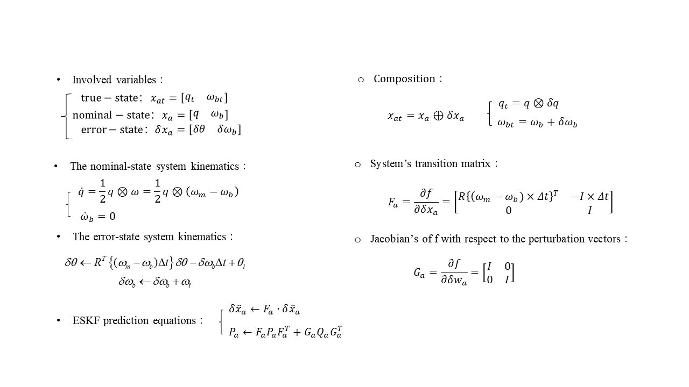
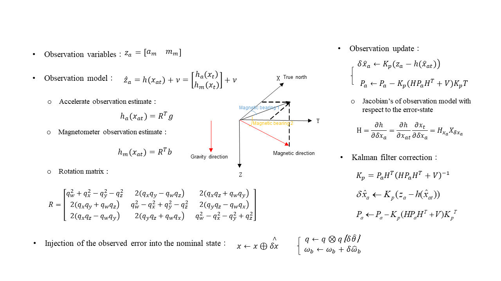
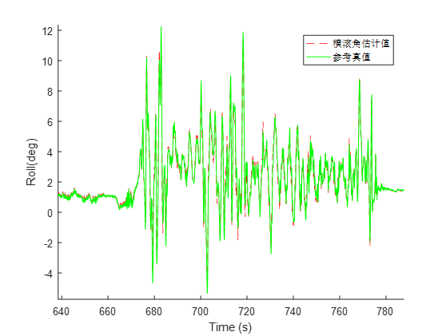
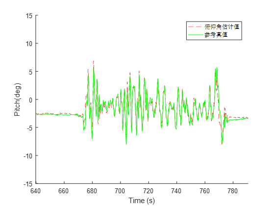
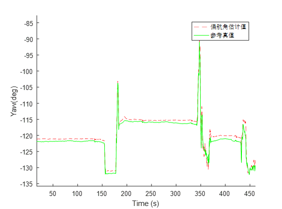

+++
# Project title.
title = "Error State Kalman Filter"

# Date this page was created.
date = 2016-03-01T00:00:00
image_preview = "featured.jpg"
# Project summary to display on homepage.
summary = "Error state Kalman filter for attitude estimation with IMU and Magnetometer data"

# Tags: can be used for filtering projects.
# Example: `tags = ["machine-learning", "deep-learning"]`
tags = ["UAV",  "Robotics", "Sensor Fusion","IMU"]

# Optional external URL for project (replaces project detail page).
external_link = ""

# Slides (optional).
#   Associate this project with Markdown slides.
#   Simply enter your slide deck's filename without extension.
#   E.g. `slides = "example-slides"` references 
#   `content/slides/example-slides.md`.
#   Otherwise, set `slides = ""`.
slides = ""

# Links (optional).
url_pdf = ""
url_slides = ""
url_video = ""
url_code = "https://github.com/NicoChou/ESKF-Attitude-Estimation"

# Custom links (optional).
#   Uncomment line below to enable. For multiple links, use the form `[{...}, {...}, {...}]`.
# url_custom = [{icon_pack = "fab", icon="twitter", name="Follow", url = "https://twitter.com/georgecushen"}]

# Featured image
# To use, add an image named `featured.jpg/png` to your project's folder. 
[image]
  # Caption (optional)
  caption = ""
  
  # Focal point (optional)
  # Options: Smart, Center, TopLeft, Top, TopRight, Left, Right, BottomLeft, Bottom, BottomRight
  focal_point = "Smart"
  preview_only = "true"
+++
The error-state Kalman filter (ESKF) is one of the tools we may use for 
combining IMU with magnetometer data to obtain a robust attitude estimation. 
It has many benefits such as avoiding issues related to over-parameterization and the consequent risk of the singularity 
of the involved covariance matrices. 
The formulation of the ESKF algorithm used for attitude estimation is as follows:

Fig.1. Error-State Kalman Filter 1

Fig.2. Error-State Kalman Filter 2

Below are results of the ESKF for roll, pitch, and yaw angles. 
The red line represents the estimation values, and the green is the ground truth.

Fig.3. Roll

Fig.4. Pitch

Fig.5. Yaw
