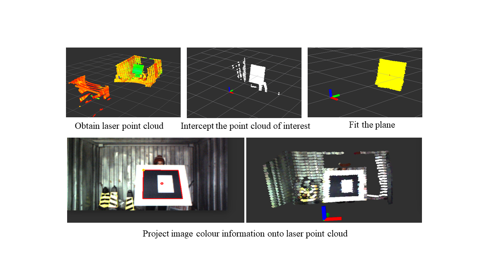

This project was to calibrate the translation and rotation matrices between camera and laser coordinate systems 
to provide laser points with color information from the image for further applications such as segmentation. 

The QR code board was used as a marker, which could be detected in both point clouds and image. 
I matched the center point pair of the QR code from the 2D points in the image and that of the 3D points in laser coordinates, 
and used the PnP method to get the relation between the two coordinates. 
The calibration procedure and fusion results are shown on Figure 1.

Fig. 1. Calibration Procedure



Video 1. Fusion results



Video 2. Fusion results
