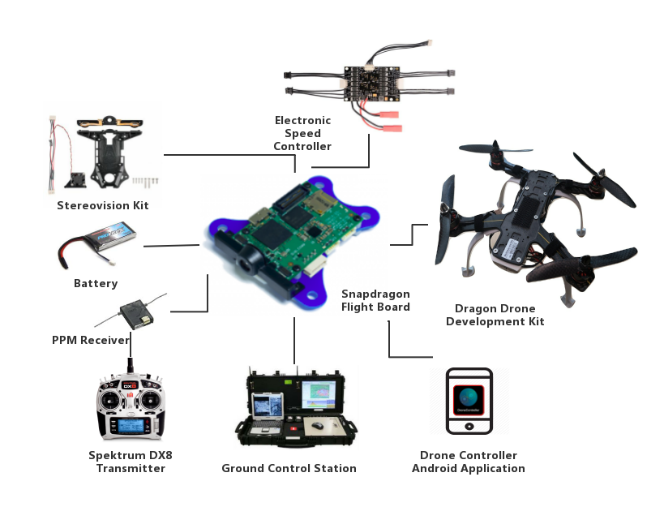

---
# Project title.
title: Dog-Drone

# Date this page was created.
date: "2018-05-01T00:00:00"
# image_preview: featured.jpg"
# Project summary to display on homepage.
summary: We provide step to step guide about building a drone with snapdragon platform and present an organized documentation that presents in detail, the platform structure as a whole, from hardware to software architecture, including installation and API related applications. 

# Tags: can be used for filtering projects.
# Example: `tags = ["machine-learning", deep-learning"]`
tags:
- UAV
- Robotics
- Autonomous Robot
- Computer Vision
- Deep Learning
- Localization
- Human Tracking
- ROS

# Optional external URL for project (replaces project detail page).
external_link: 

# Slides (optional).
#   Associate this project with Markdown slides.
#   Simply enter your slide deck's filename without extension.
#   E.g. `slides: example-slides"` references 
#   `content/slides/example-slides.md`.
#   Otherwise, set `slides: `.
slides: 

# Links (optional).
url_pdf: https://ieeexplore.ieee.org/document/8592913?denied=
url_slides: 
url_video: https://www.youtube.com/watch?v=kSz1FB7mgqU
url_code: 
 
# Custom links (optional).
#   Uncomment line below to enable. For multiple links, use the form `[{...}, {...}, {...}]`.
# url_custom = [{icon_pack: fab", icon="twitter", name="Follow", url: https://twitter.com/georgecushen"}]

# Featured image
# To use, add an image named `featured.jpg/png` to your project's folder. 
image:
  # Caption (optional)
  caption: 
  
  # Focal point (optional)
  # Options: Smart, Center, TopLeft, Top, TopRight, Left, Right, BottomLeft, Bottom, BottomRight
  focal_point: Smart
  preview_only: true
  

# toc: true
---

<body>
System Diagram
</body>
 
From March to June 2018, I worked on the proof-of-concept phase of the “Dog-Drone” project. The objective is to immobilize suspicious individuals in an indoor environment by flying multiple drones aggressively around them. My work includes trajectory generation and system integration.

This work has resulted in papers published in the IEEE ICCA and IECON 2018. We provide step to step guide about building a drone with snapdragon platform and present an organized documentation that presents in detail, the platform structure as a whole, from hardware to software architecture, including installation and API related applications. 



Dog-Drone demo

 
At previous stage, to prove the concept, we are using the off-the-shelf flight platform with a visual odometry integration. Right now we have built our new drone platform due to the limitation of the commercial product and have conducted tests of flying multiple drones aggressively in an indoor environment. 

