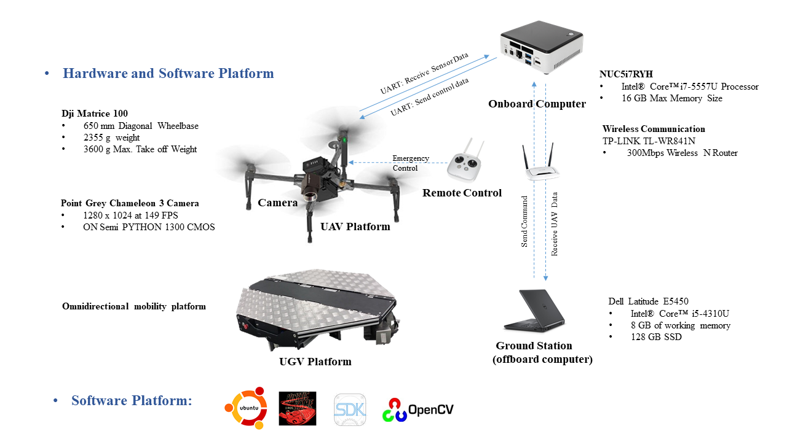
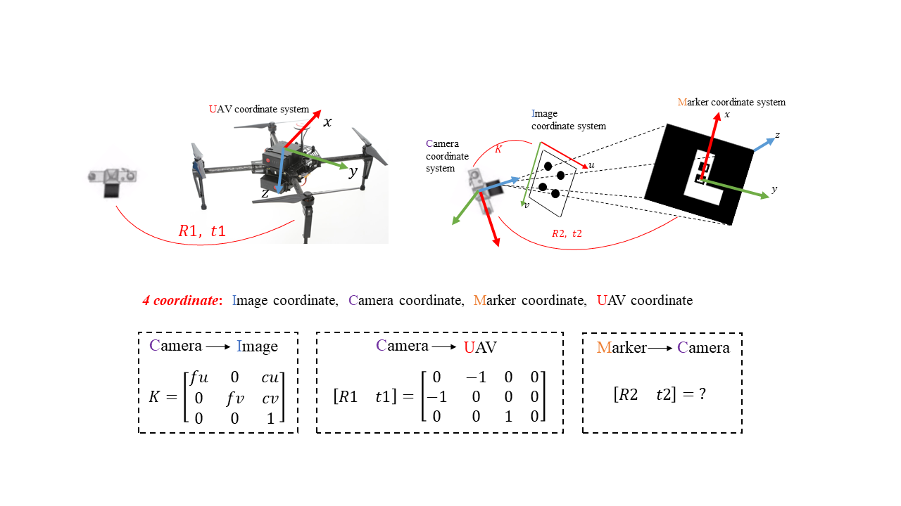
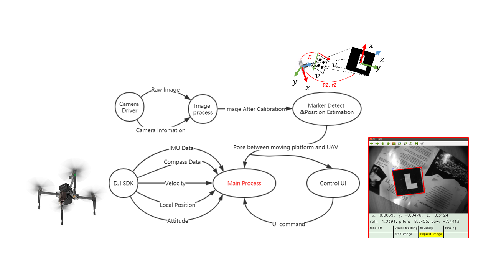

--- 
# Project title.
title: GPS-Denied Vision Control of UAV 

# Date this page was created.
date: "2017-03-15T00:00:00"
 
summary: Develop an autonomous launch, tracking and landing system for an Unmanned Aerial Vehicle (UAV).
# Tags: can be used for filtering projects.
# Example: `tags = [ machine-learning ,  deep-learning ]`
tags:
- UAV 
- Robotics  
- Autonomous Robot 
- Computer Vision 
- ROS  
- Matrice 100 
- DJI SDK 

# Optional external URL for project (replaces project detail page).
external_link:  

# Slides (optional).
#   Associate this project with Markdown slides.
#   Simply enter your slide deck's filename without extension.
#   E.g. `slides: example-slides ` references 
#   `content/slides/example-slides.md`.
#   Otherwise, set `slides:  `.
slides:   

# Links (optional).
url_pdf:  
url_slides:  
url_video:  

# Custom links (optional).
#   Uncomment line below to enable. For multiple links, use the form `[{...}, {...}, {...}]`.
# url_custom = [{icon_pack: fab , icon= twitter , name= Follow , url: https://twitter.com/georgecushen }]

# Featured image
# To use, add an image named `featured.jpg/png` to your project's folder. 
image:
  # Caption (optional)
  # caption: Photo by rawpixel on Unsplash 
  
  # Focal point (optional)
  # Options: Smart, Center, TopLeft, Top, TopRight, Left, Right, BottomLeft, Bottom, BottomRight
  focal_point: Smart 
--- 
From March 2017 to December 2018, I worked on “Project Micrathene” with a Ph.D. student who focused on controls. 
The objective of this project was to develop an autonomous launch, tracking and landing system for an Unmanned Aerial Vehicle (UAV). 
The object to track and land on was a moving ground platform, and everything was to be done without GPS.

In this project, vision is used to estimate the pose, 
the translation and rotation relationship, between the UGV and the UAV. 
The pose was used for flight control during different states of the UAV. 

The hardware platform contains:

- DJI Matrice 100 fly platform
- Point Grey Chameleon 3 camera
- NUC onboard computer. 
- Omnidirectional mobility platform

Communication between the onboard and offboard computer is established over Wi-Fi. 

The software involves:
 
- Ubuntu
- ROS Kinetic
- OpenCV
- DJI SDK

Fig. 1. Hardware and Software Platform

A marker was designed to obtain the relative pose between the UAV and the UGV platform. 
There are four coordinate systems: image, camera, marker and UAV. 
The transformation matrix between different coordinate systems is shown on Figure 2. 
n order to control the UAV, the pose between the camera and the marker, which is [R2 t2], has to be calculated with the PnP method. 
The pose between the UAV and the moving platform can then be obtained through another coordinate transform.

Fig. 2. Transformation matrix

The software design of this project is shown on Figure 3:

1. Obtain undistorted images through image processing;

2. Send these images to the marker detection process to get the camera pose w.r.t. the marker;

3. In the main process, a state machine was run to process all the data and commands, 
including the pose between the moving platform and the UAV, sensor data from DJI SDK and the command from the off-board computer.

Fig. 3. Software design

The final demonstration is shown in the following video:


Demo Video
