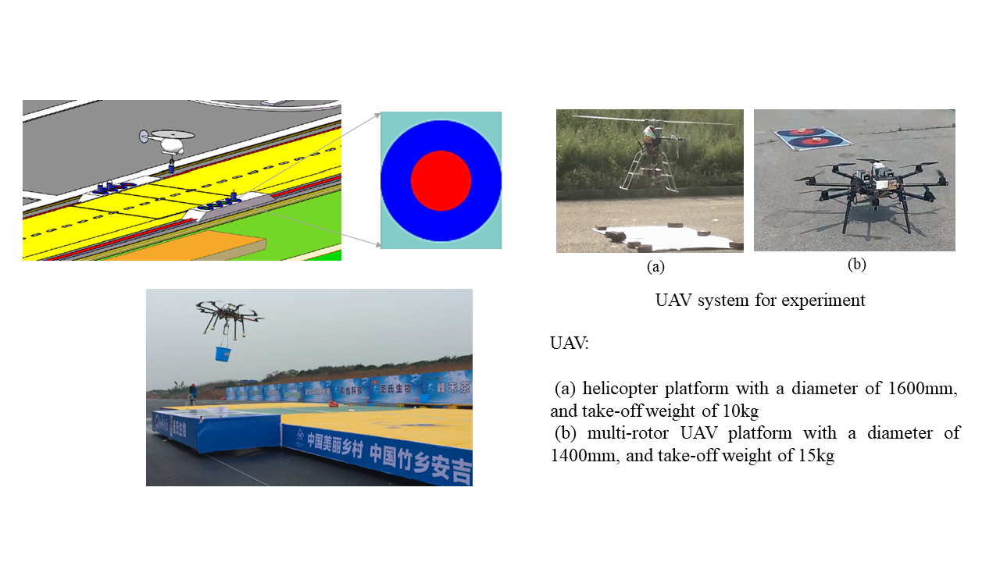
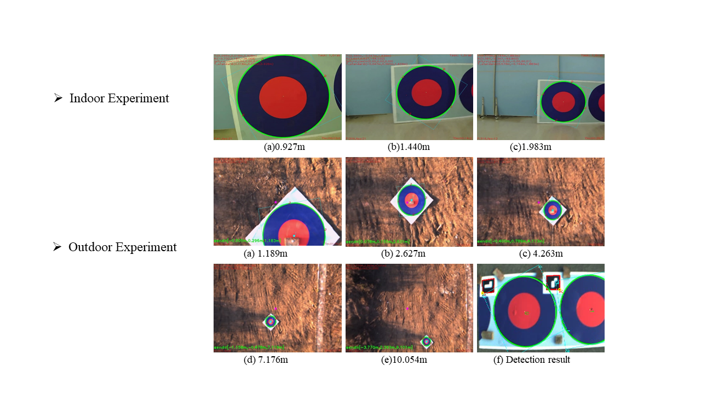

+++
# Project title.
title = "The International Unmanned Aerial Vehicle Grand Prix"

# Date this page was created.
date = 2015-10-01T00:00:00
image_preview = "featured.jpg"
# Project summary to display on homepage.
summary = "The 3rd International Unmanned Aerial Vehicle Grand Prix with the task of autonomous cargo transportation with UAV in a GPS-Denied environment."

# Tags: can be used for filtering projects.
# Example: `tags = ["machine-learning", "deep-learning"]`
tags = ["UAV",  "Robotics", "Autonomous Robot", "Computer Vision","Visual Guidance","Pixhawk"]

# Optional external URL for project (replaces project detail page).
external_link = ""

# Slides (optional).
#   Associate this project with Markdown slides.
#   Simply enter your slide deck's filename without extension.
#   E.g. `slides = "example-slides"` references 
#   `content/slides/example-slides.md`.
#   Otherwise, set `slides = ""`.
slides = ""

# Links (optional).
url_pdf = ""
url_slides = ""
url_video = ""
url_code = ""

# Custom links (optional).
#   Uncomment line below to enable. For multiple links, use the form `[{...}, {...}, {...}]`.
# url_custom = [{icon_pack = "fab", icon="twitter", name="Follow", url = "https://twitter.com/georgecushen"}]

# Featured image
# To use, add an image named `featured.jpg/png` to your project's folder. 
[image]
  # Caption (optional)
  caption = ""
  
  # Focal point (optional)
  # Options: Smart, Center, TopLeft, Top, TopRight, Left, Right, BottomLeft, Bottom, BottomRight
  focal_point = "Smart"
+++
Along with 4 other teammates from the [State Key Laboratory of Robotics](http://english.sia.cas.cn/rh/rp/201408/t20140814_125856.html), 
I participated in the 3rd International Unmanned Aerial Vehicle Grand Prix, 
held at the end of October 2015. 
The task of this competition was to accomplish the autonomous cargo transportation task with a UAV. 
There were two moving platforms: 
both had four markers and one had 4 buckets placed on it. 
The UAV had to transport buckets between the two moving platforms, as shown on Figure 1.

Fig. 1. Unmanned Aerial Vehicle Grand Prix

I worked specifically on the visual guidance design. 
Our team finished 2nd out of 20 teams in total.
The vision-based guidance work can be divided into 2 parts: 
ellipse detection and position estimation.

#### Ellipse detection

The ellipse detection algorithm is divided into two parts: whole ellipse detection and partial ellipse detection. 

- Whole ellipse detection

	Once we have a new image, we need to get all the contours in that image through edge detection. 
Then, we calculate the AMIs (Affine Moment Invariants) to see if the contours form an ellipse. 
As all circles and ellipse have the same AMIs theoretical value, 
the contour satisfying the theoretical value can be considered as an ellipse.

- Partial ellipse detection

	It is common that only parts of the ellipse can be seen by a digital camera due to the limited field of view, 
and the whole ellipse detection method cannot detect this sort of ellipse. 
We then used a robust method to detect partial ellipses in the image. 
First, we computed the convex hull for each contour that is not classified as a whole ellipse, 
then fitted ellipses for each convex hull, 
while computing the algebraic error between the convex hulls and the fitted ellipses.

#### Position estimation

Position estimation helped us get the relative position between the circle markers and the UAV, 
that we leveraged to track the circle to navigate the UAV. 
It involved three coordinate frames: world, camera and image. 
The principle is that we have some known coordinate point in the world frame and its corresponding coordinate point in the image frame. 
We then use the DLT to get the transformation between the two coordinate frames and thus obtain the position estimation. 

Here, we make the word frame’s center as the circle center, 
with the Z-axis of the word frame orthogonal to the circle plane. 
Thus, the four points on the world frame are evenly distributed on the circle as the diameter of the circle is known. 
Ellipse detection then yields four corresponding points in the image: 
we can thus estimate the rotation and transformation matrices between the circle markers and the UAV, which we use to control the UAV.

Fig. 2. Detection Results



Video 1. Indoor testing



Video 2. Competition day
