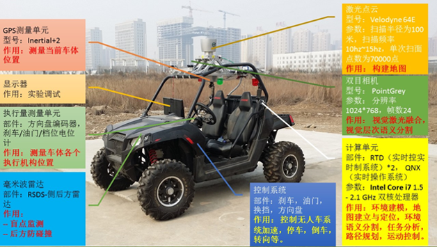
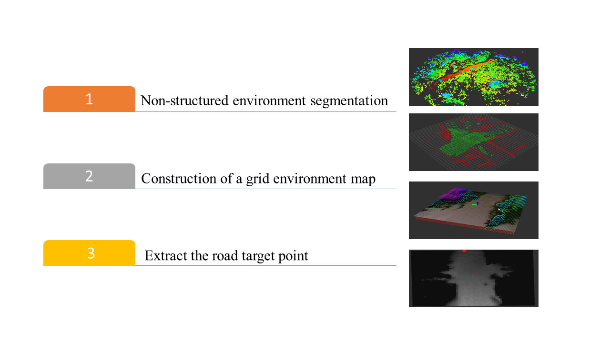
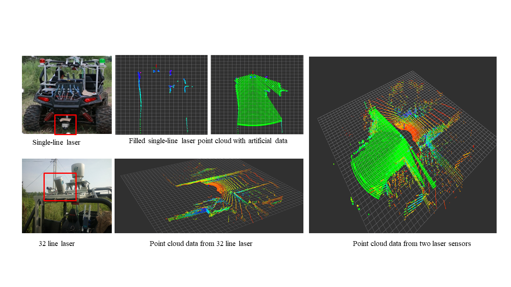
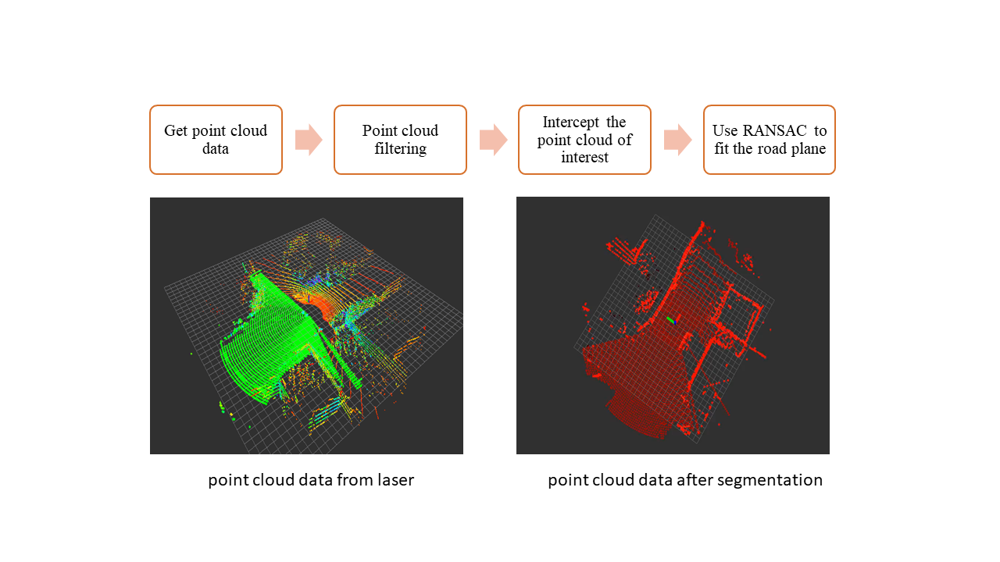
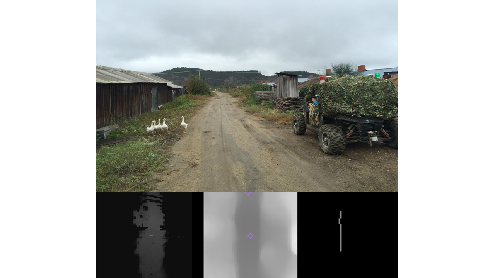
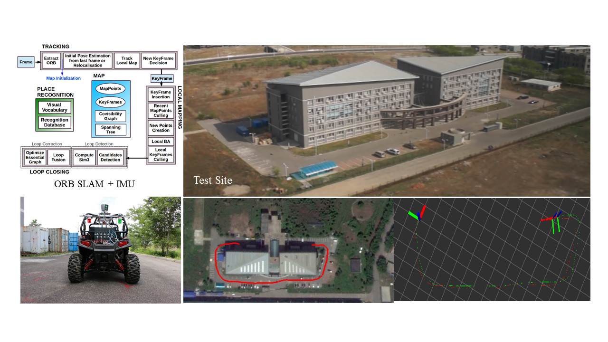

---
# Project title.
title: Unmanned Ground Systems Challenge

# Date this page was created.
date: "2016-03-01T00:00:00"
# Project summary to display on homepage.
summary: 

# Tags: can be used for filtering projects.
# Example: `tags = ["machine-learning", "deep-learning"]`
tags:
- UGV
- Robotics
- Autonomous Robot 
- Computer Vision
- Localization
- ROS

# Optional external URL for project (replaces project detail page).
external_link: 

# Slides (optional).
#   Associate this project with Markdown slides.
#   Simply enter your slide deck's filename without extension.
#   E.g. `slides: example-slides"` references 
#   `content/slides/example-slides.md`.
#   Otherwise, set `slides: "`.
slides: 

# Links (optional).
url_pdf: 
url_slides: 
url_video: 
url_code: 

# Custom links (optional).
#   Uncomment line below to enable. For multiple links, use the form `[{...}, {...}, {...}]`.
# url_custom = [{icon_pack: fab", icon="twitter", name="Follow", url: https://twitter.com/georgecushen"}]

# Featured image
# To use, add an image named `featured.jpg/png` to your project's folder. 
image:
  # Caption (optional)
  caption: 
  
  # Focal point (optional)
  # Options: Smart, Center, TopLeft, Top, TopRight, Left, Right, BottomLeft, Bottom, BottomRight
  focal_point: Smart
  preview_only: true
toc: true
---
Along with 3 other teammates from the [State Key Laboratory of Robotics](http://english.sia.cas.cn/rh/rp/201408/t20140814_125856.html), 
I participated in the Unmanned Ground Systems Challenge in October 2016 and worked specifically on the environment map 
building and localization under GPS signal lost situation.

This challenge was held in a real field environment, 
including wild battlefield task execution, 
city battlefield search and investigation, and highland transportation. 

Fig. 1. Our UGV platform

### Environment Map

Built an environment map for non-structured fields with the following steps:

Fig. 2. Environment Map BUilding Procedure

The laser data was collected from different lasers: single-line, 32-line, and 64-line. 
The data was fused after calibration and having manually filled certain points.

Fig. 3. Fuse Laser Data

A road plane was fitted with a RANSAC method.

Fig. 4. Point Clouds Segmentation

The grid map was built with the help of the [grid_map](https://github.com/ANYbotics/grid_map) package. 
Finally, the road target was extracted through road skeleton extraction from the image generated from the environment map.

Fig. 5. Road Target Extraction

Thus, we obtained all the perception information needed to drive a car intelligently in a field environment.



**Obstacle Avoidance Demo**

### Localization without GPS

Two methods were conducted to meet the requirements. 

#### 1. Visual Inertial Odometry

I did this by combining the orb slam with IMU.

Fig. 6. Visual Inertial Odometry



#### 2. Laser Odometry   



